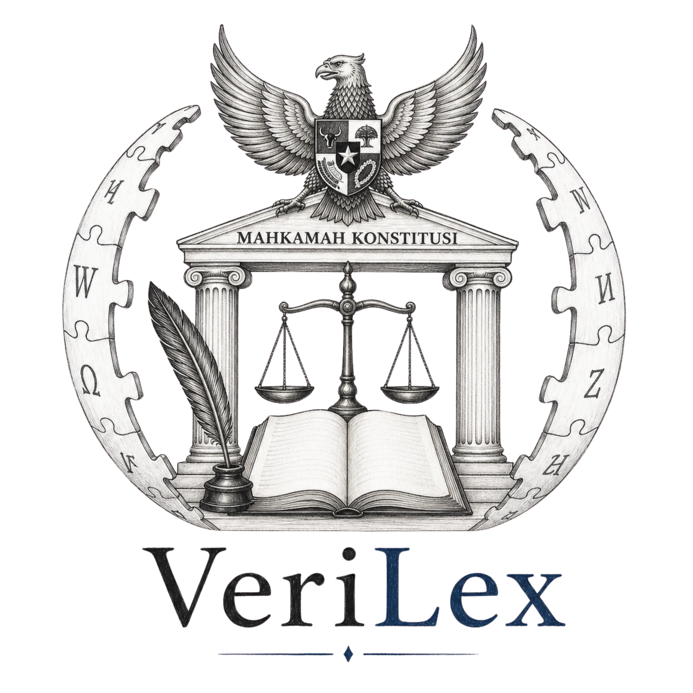

# VeriLex

**Platform Referensi Maksim Hukum Latin Indonesia**

## Tentang VeriLex

VeriLex adalah platform referensi digital terintegrasi pertama di Indonesia untuk ensiklopedia maksim hukum Latin. Platform ini dirancang untuk memberikan akses yang akurat dan otoritatif kepada prinsip-prinsip hukum Latin fundamental, memfasilitasi penelitian hukum, pemahaman, dan aplikasi maksim-maksim dasar di berbagai bidang hukum.

VeriLex ditujukan untuk mahasiswa hukum, praktisi hukum, dan akademisi yang membutuhkan referensi komprehensif tentang maksim hukum Latin yang sering digunakan dalam sistem hukum Indonesia.

## Fitur Utama

### Database Maksim Hukum
- **Koleksi Kurasi**: Kumpulan maksim hukum Latin yang dikurasi dan dikategorikan berdasarkan bidang hukum (Hukum Pidana, Hukum Perdata, Hukum Tata Negara, Hukum Internasional, dan Hukum Administrasi)
- **Analisis Mendalam**: Penjelasan detail untuk setiap maksim, termasuk terjemahan literal, makna hukum, konteks historis, dan yurisprudensi
- **Integrasi Putusan Pengadilan**: Contoh nyata bagaimana maksim tertentu diterapkan dalam putusan pengadilan

### Modul Pembelajaran Interaktif
- **Flashcard**: Kartu flash dengan algoritma Spaced Repetition untuk menghafal maksim secara efektif
- **Kuis Interaktif**: Kuis untuk menguji pemahaman dan retensi materi
- **Text-to-Speech**: Fitur aksesibilitas untuk pengucapan Latin

### Pencarian & Indeks
- **Pencarian Canggih**: Pencarian berbasis kata kunci dengan filtering spesifik bidang hukum
- **Indeks Alfabet**: Indeks alfabetis untuk retrieval informasi yang efisien
- **Filter Kategori**: Filter berdasarkan kategori hukum untuk mempersempit hasil pencarian

### Fitur Pengguna
- **Sistem Autentikasi**: Pendaftaran dan login pengguna
- **Favorit**: Simpan maksim ke daftar favorit untuk akses cepat
- **Dashboard Personal**: Dashboard untuk melihat progres belajar dan aktivitas
- **Mode Reviewer**: Mode kontribusi untuk reviewer yang memverifikasi konten

## Cara Menggunakan VeriLex

### Mencari Maksim Hukum
1. Buka halaman pencarian atau gunakan kolom pencarian di header
2. Ketik kata kunci (nama maksim, terjemahan, atau bidang hukum)
3. Filter hasil berdasarkan kategori hukum yang relevan
4. Klik pada maksim untuk melihat detail lengkap

### Mempelajari dengan Flashcard
1. Akses menu Flashcard dari navigasi
2. Pilih kategori maksim yang ingin dipelajari
3. Gunakan kartu flash untuk menghafal maksim
4. Sistem akan mengulang maksim yang sulit diingat dengan algoritma Spaced Repetition

### Menguji Pengetahuan dengan Kuis
1. Buka menu Quiz dari navigasi
2. Pilih kategori atau mode kuis yang diinginkan
3. Jawab pertanyaan untuk menguji pemahaman
4. Lihat skor dan review jawaban yang salah

### Menyimpan Favorit
1. Login atau daftar akun terlebih dahulu
2. Buka halaman detail maksim
3. Klik ikon favorit untuk menyimpan ke daftar favorit
4. Akses daftar favorit dari menu profil

### Dashboard Pengguna
Setelah login, Anda dapat mengakses dashboard untuk:
- Melihat progres belajar
- Mengelola daftar favorit
- Melihat riwayat aktivitas
- Mengatur profil pengguna

## Kategori Maksim Hukum

VeriLex mengelompokkan maksim hukum Latin ke dalam beberapa bidang:

- **Hukum Pidana**: Maksim terkait asas-asas hukum pidana
- **Hukum Perdata**: Maksim yang digunakan dalam hukum perdata dan kontrak
- **Hukum Tata Negara**: Maksim konstitusional dan tata negara
- **Hukum Internasional**: Maksim dalam hukum internasional
- **Hukum Administrasi**: Maksim dalam hukum administrasi negara

## Akses Platform

VeriLex dapat diakses secara online melalui:

**Website**: [VeriLex](https://veri-lex-demo.vercel.app/)

Platform ini dapat diakses dari berbagai perangkat (desktop, tablet, mobile) dan tidak memerlukan instalasi tambahan.

## Tim VeriLex

- **Development**: VeriLex Development Team
- **Editorial**: VeriLex Editorial Team
- **Review**: Legal Reviewers

## Kontribusi

Kontribusi sangat diapresiasi! Jika Anda ingin berkontribusi:

1. Fork repository ini
2. Buat branch fitur (`git checkout -b fitur/fitur-baru`)
3. Commit perubahan Anda (`git commit -m 'Tambah fitur baru'`)
4. Push ke branch (`git push origin fitur/fitur-baru`)
5. Buka Pull Request

## Lisensi

Proyek ini bersifat proprietary dan ditujukan untuk penggunaan internal dan referensi.

## Tim VeriLex

- **Development**: VeriLex Development Team
- **Editorial**: VeriLex Editorial Team
- **Review**: Legal Reviewers

## Kontak

Untuk pertanyaan, saran, atau dukungan, silakan hubungi tim VeriLex melalui:
- Email: admin.verilex@gmail.com
- Website: [VeriLex](https://veri-lex-demo.vercel.app/)

---

**Dibuat untuk komunitas hukum Indonesia**

© 2025 VeriLex. All rights reserved.

